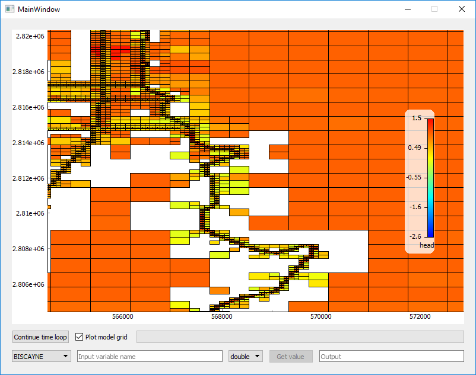

# BMI Debug GUI



## How to develop on the BMI Debug GUI

1. Install Anaconda or Miniconda
2. Open a shell where you have access to `conda` (e.g. via Anaconda Navigator -> Environments -> Triangle -> Open Terminal)
3. Go to the root of the project folder
4. Execute `conda env create`
5. Activate the environment with `conda activate ENVNAME`
6. Run `python bmi_debug_gui/__main__.py`

## How to create an executable with pyinstaller

To create a single executable run
```
pyinstaller -F /path/to/__main__.py
```
or to create an executable which starts up faster but consists of multiple files, run
```
pyinstaller /path/to/__main__.py
```

## How to convert .ui files to .py files
```
pyuic5 -o [name].py [name].ui
```

## PyQtGraph

This GUI uses the [pyqtgraph](http://www.pyqtgraph.org/) package for its plotting capabilities. In order to display 3D graphics, install `pyopengl` via conda.
However, take care **not** to install `pyopengl-accelerate` as it seems to make problems.